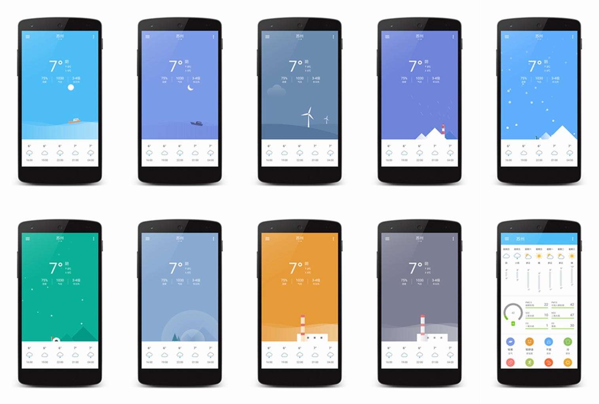

## 假装看天气 ##

>2018-05-07 更新：
我很遗憾的关闭了天气相关的几个 api，天气 key 和城市数据请大家自行去和风天气官网申请下载，详情见 [#8](https://github.com/li-yu/FakeWeather/issues/8)

>2017-12-15 更新：
时间过得很快，这个项目已经有一年了，因为是练手的项目，写完之后也没过多的维护，直到有一次在站酷上看到一个[天气设计原型](http://www.zcool.com.cn/work/ZMjE1MDgwMjQ=.html)，然后我把天气模块给重写了。

更多细节可以查看最新博文[**《重构天气》**](http://liyuyu.cn/2017/12/15/Refactor-fake-weather/)

这个项目的前身原本只是为了实现公交查询而练手的 App，一次偶然的机会，看到了开源项目 [就看天气](https://github.com/xcc3641/SeeWeather)，我被这单纯而简单的天气软件所吸引，所以增加了天气查询功能。工作这么多年我一直觉得，很多新的特性和技术很少在工作项目中应用到，所以有了利用空闲时间持续学习和开发的打算。后面增加了 [闲读](http://gank.io/xiandu) 和妹子图等模块，整个 App 变成了一个大杂烩，索性就叫『假装看天气』吧。

整个项目未完全遵循 Material Design 风格，同时在构架和编码方面可能也不尽如人意，但作为现阶段的学习和总结，我希望可以给大家带来帮助。
### 简介 ###
『假装看天气』─── 天气预报 & 公交查询 & 资讯阅读 & 妹纸福利 的 Android 客户端

- 天气，自动定位当前城市，11 种动态天气效果
- 公交，定位搜索附近线路和站台，支持手动查询和收藏（仅苏州）
- 闲读，阅读最新科技资讯，读那些值得读的
- 福利，大量妹子图，你懂的，还不赶紧上车

### 更新历史 

[Release Notes](https://github.com/li-yu/FakeWeather/releases)

### 下载 

[直接下载 v1.3.3_20180308](http://7xp1a1.com1.z0.glb.clouddn.com/FakeWeather/FakeWeather_v1.3.3_20180308.apk)

### 编译环境 ###
- Android Studio 3.1.1
- jdk1.8.0_144

### 特别感谢 ###
- [天气视觉探索-尝试方案](http://www.zcool.com.cn/work/ZMjE1MDgwMjQ=.html)
- [ZUI-Weather](http://www.zcool.com.cn/work/ZMjMwNDMxNDA=.html)
- [干货集中营](http://gank.io) 提供闲读和部分妹子数据
- [就看天气](https://github.com/xcc3641/SeeWeather) 提供学习灵感
- [妹纸&gank.io](https://github.com/drakeet/Meizhi) 提供学习参考
- [馒头先生](https://github.com/oxoooo/mr-mantou-android) 提供学习参考
- [和风天气](http://www.heweather.com/) 提供天气数据
- [百度定位](http://lbsyun.baidu.com/index.php?title=android-locsdk) 提供定位服务
- [无线苏州](http://www.wisesz.com/index.shtml) 提供公交数据
- 『[煎蛋](http://jandan.net/)』『[妹子图](http://www.mzitu.com)』 提供妹纸数据

### 开源库 ###
- [Glide](https://github.com/bumptech/glide)
- [Jsoup](https://github.com/jhy/jsoup)
- [RxJava](https://github.com/ReactiveX/RxJava)
- [Retrofit](https://github.com/square/retrofit)
- [LitePal](https://github.com/LitePalFramework/LitePal)
- [EventBus](https://github.com/greenrobot/EventBus)
- [Lottie-android](https://github.com/airbnb/lottie-android)
- [RxAndroid](https://github.com/ReactiveX/RxAndroid)
- [SeeWeather](https://github.com/xcc3641/SeeWeather)
- [RxBinding](https://github.com/JakeWharton/RxBinding)
- [RxPermissions](https://github.com/tbruyelle/RxPermissions)
- [material-dialogs](https://github.com/afollestad/material-dialogs)
- [ASimpleCache](https://github.com/yangfuhai/ASimpleCache)
- [FinestWebView-Android](https://github.com/TheFinestArtist/FinestWebView-Android)
- [BaseRecyclerViewAdapterHelper](https://github.com/CymChad/BaseRecyclerViewAdapterHelper)

### 免责声明 ###

- 项目中部分图片素材来自网络，版权归属原作者，侵立删
- 项目中所使用的 api 部分搜集于网络，仅供学习和交流使用

### License ###
[Apache License
Version 2.0](https://github.com/li-yu/FakeWeather/blob/master/LICENSE)
